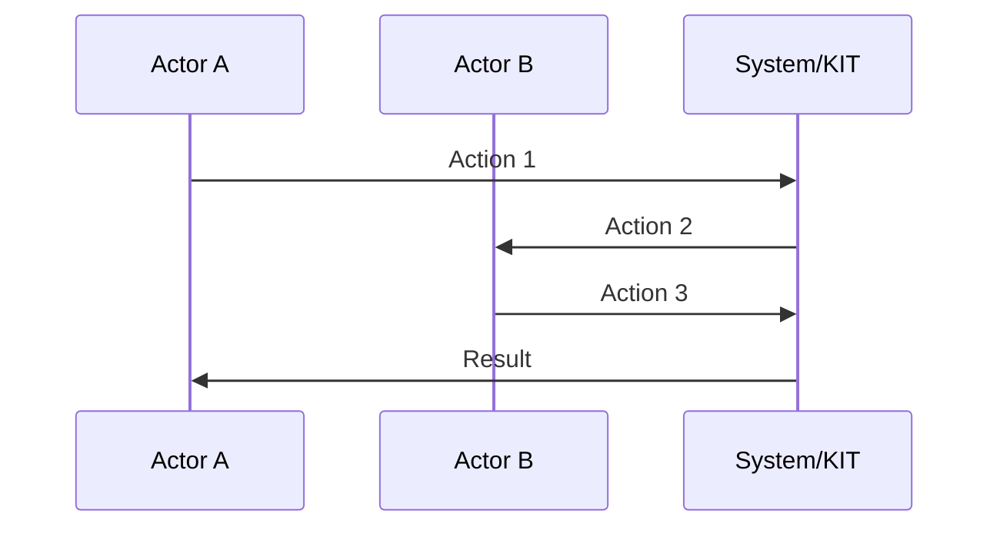

<!--
 ********************************************************************************* 
 * Copyright (c) 2025 Contributors to the Eclipse Foundation
 * 
 * See the NOTICE file(s) distributed with this work for additional
 * information regarding copyright ownership.
 * 
 * This program and the accompanying materials are made available under the
 * terms of the Apache License, Version 2.0 which is available at
 * https://www.apache.org/licenses/LICENSE-2.0.
 * 
 * Unless required by applicable law or agreed to in writing, software
 * distributed under the License is distributed on an "AS IS" BASIS, WITHOUT
 * WARRANTIES OR CONDITIONS OF ANY KIND, either express or implied. See the
 * License for the specific language governing permissions and limitations
 * under the License.
 * 
 * SPDX-License-Identifier: Apache-2.0
 ********************************************************************************/
-->

## Adoption View


Welcome to the **[KIT_NAME] KIT Adoption View**. This view provides business value, strategic benefits, and use cases for business stakeholders and decision-makers.

:::info Target Audience
Business Managers, Product Owners, Solution Architects, Industry Experts, and Decision Makers.
:::

---

## Vision & Mission

### Vision

The vision of the Tractus-X Tariff use case is to provide a harmonized data exchange mechanism that allows tariff-relevant information to be reused across companies and systems, enabling largely automated tariff calculation and reducing the need for manual interpretation and consolidation.

### Mission

The mission of the Tractus-X Tariff use case is to enable partners across the automotive value chain to exchange tariff-relevant data in a standardized and sovereign manner, reducing manual overhead and enabling efficient aggregation of tariff information across multi-tier supply chains.

---

## Business Value

### Value Proposition #1: [Title]

**Benefit**: Reduced effort and cost for tariff data collection and aggregation.

**Target Stakeholders**: OEMs, Tier-1 to Tier-N suppliers

**Measurable Outcomes**: Reduction in manual data collection effort, lower administrative costs, faster availability of aggregated tariff data

### Value Proposition #2: [Title]

**Benefit**: Improved tariff compliance and reduced risk of penalties or delays due to incomplete or incorrect tariff information.

**Target Stakeholders**: OEMs, Suppliers, Compliance and Customs Departments

**Measurable Outcomes**: Fewer compliance errors, reduced number of customs queries or audits, lower penalty and delay rates

### Value Proposition #3: [Title]

**Benefit**: Enablement of interoperable tariff solutions and services based on Catena-X standards.

**Target Stakeholders**: Solution Providers, suppliers

**Measurable Outcomes**: Number of interoperable solutions, adoption rate of the Tariff data model, reduction in proprietary integrations.

---
<!--
### Summary of Business Benefits

| Stakeholder Type | Key Benefits | Time to Value |
|------------------|--------------|---------------|
| **OEMs** | [List 2-3 benefits for large enterprises] | [e.g., "6 months"] |
| **SMEs** | [List 2-3 benefits for small-medium enterprises] | [e.g., "3 months"] |
| **Solution Providers** | [List 2-3 benefits for tech vendors] | [e.g., "90 days"] |
| **Data Providers** | [List 2-3 benefits for data providers] | [e.g., "4 weeks"] |
-->
---

## Use Case Context

### Industry Challenge

Recent and rapidly changing tariff regulations impose significant challenges on the automotive supply chain, which is characterized by highly globalized, multi-tier sourcing structures. Tariff-relevant information such as country of origin, production steps, material composition, and preferential trade eligibility is fragmented across many partners and systems.

Today, this data is often collected manually, inconsistently, and on demand, leading to high administrative overhead, long response times, limited transparency, and increased risk of errors or non-compliance. Companies struggle to aggregate tariff-relevant data across tiers, to assess tariff exposure in a timely manner, and to react efficiently to regulatory changes.

As a result, the automotive industry faces higher costs, compliance risks, and reduced agility in managing tariffs within complex and dynamic global supply chains.

---

## Use Cases

### Primary Use Case: [Use Case Name]

**Description**: [Use case description]

**Actors**: [Actor 1], [Actor 2], [Actor 3]

**Process Flow**:

1. [Step 1 description]
2. [Step 2 description]
3. [Step 3 description]

**Business Outcomes**: [Key outcomes]

**Success Metrics**: [Key metrics]

### Secondary Use Case: [Use Case Name]

[Same structure as primary use case]

### Additional Use Cases

1. **[Use Case 3]**: [Brief description]
2. **[Use Case 4]**: [Brief description]

---

## Business Processes

:::tip
For industry-specific business processes, see the [Industry Extensions](https://github.com/eclipse-tractusx/eclipse-tractusx.github.io/tree/main/docs-kits/kit-template/industry-extensions) documentation.
:::

### Core Business Process: [Process Name]

**Purpose**: [Business goal]

**Stakeholders**: [List key stakeholders]

**Process Steps**:



**Process Description**: [Brief description of key steps]


### Access & Usage Policies

:::warning Industry-Specific Policies
For industry-specific policy requirements, refer to the [Industry Extensions](https://github.com/eclipse-tractusx/eclipse-tractusx.github.io/tree/main/docs-kits/kit-template/industry-extensions) section.
:::

#### Example Access Policy

```json
{
  "policy": {
    "permission": {
      "action": "use",
      "constraint": {
        "leftOperand": "UsagePurpose",
        "operator": "isAnyOf",
        "rightOperand": [
            "mx.core.digitalTwinRegistry:1"
        ]
      }
    }
  }
}
```

[Brief policy explanation]

---

## Semantic Models

[Brief explanation of semantic models used in this KIT]

### Core Semantic Models

| Model Name | Version | Purpose | Link |
|------------|---------|---------|------|
| [Model 1] | X.Y.Z | [Model purpose] | [Link] |
| [Model 2] | X.Y.Z | [Model purpose] | [Link] |

### Model Example: [Model Name]

**Description**: [Brief description]

**Key Attributes**: [List key attributes]

**Example**:

```json
{
  "attribute1": "example-value",
  "attribute2": 12345
}
```

---

## Standards

:::warning Industry-Specific Standards
For industry-specific standards, refer to the [Industry Extensions](https://github.com/eclipse-tractusx/eclipse-tractusx.github.io/tree/main/docs-kits/kit-template/industry-extensions) section.
:::

### Supported Standards

| Standard | Version | Description | Compliance Level | Link |
|----------|---------|-------------|------------------|------|
| [Standard 1] | X.Y | [Description] | Mandatory/Optional | [Link] |
| [Standard 2] | X.Y | [Description] | Mandatory/Optional | [Link] |

---

## Tutorials & Resources

### Getting Started Tutorial

[Link to tutorial or brief description]

### Video Resources

| Title | Duration | Link |
|-------|----------|------|
| [Video 1] | [X min] | [Link] |

### Whitepaper

[Link to whitepaper if available]

## NOTICE

This work is licensed under the [CC-BY-4.0](https://creativecommons.org/licenses/by/4.0/legalcode).

- SPDX-License-Identifier: CC-BY-4.0
- SPDX-FileCopyrightText: [YYYY] [YOUR_COMPANY]
- SPDX-FileCopyrightText: [YYYY] Contributors to the Eclipse Foundation
- Source URL: [https://github.com/eclipse-tractusx/eclipse-tractusx.github.io](https://github.com/eclipse-tractusx/eclipse-tractusx.github.io)
